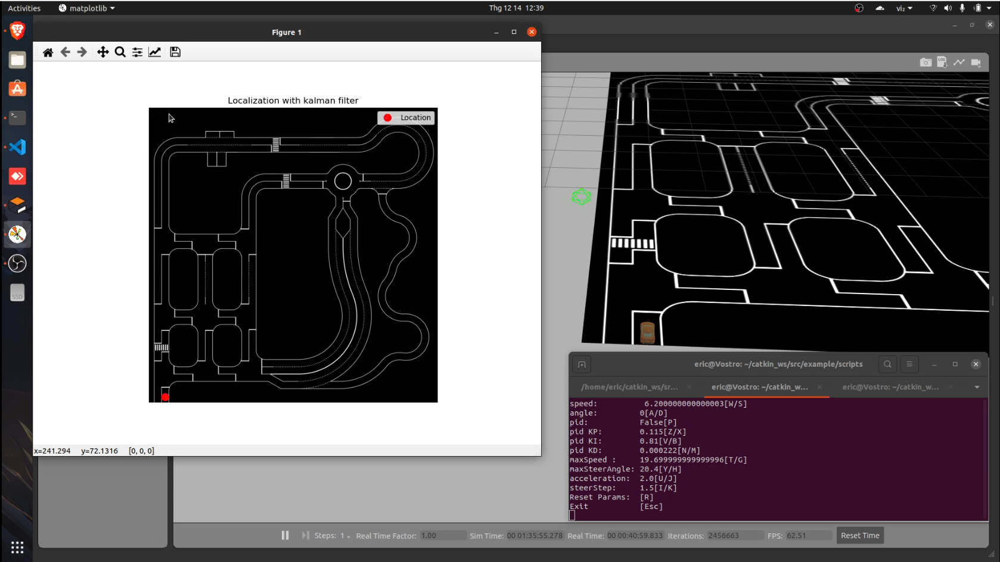
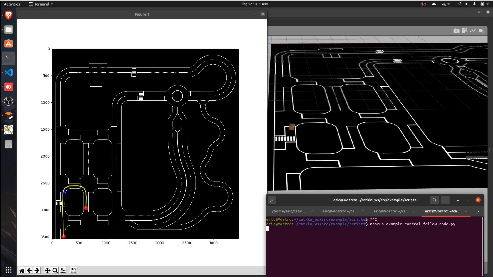
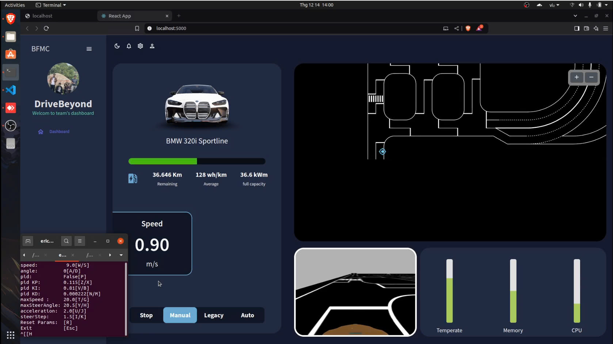

Team: DriveBeyond  
Date: 16/12/2024  
Description: This is a report article about project status 1 

# 📋 Table of Contents

* [Task 1 Path Planning](#task-1-path-planning)  

* [Task 2 Display Current Coordinates](#task-2-display-current-coordinates)  

* [Task 3 Control Vehicle Along Planned Path](#task-3-control-vehicle-along-planned-path)  

* [Task 4 Lane Following Control](#task-4-lane-following-control)  

* [Task 5 Display Vehicle Status on Website](#task-5-display-vehicle-status-on-website)  


# Task 1 Path Planning 
## 📂 Project Directory Structure
```bash
~/DriveBeyondBFMC/ 
├── src/ │  
|        └── example/ │ 
|                     ├── project_1/ │
|                                    │ 
|                                    └── task_1/  │ 
|                                                 ├── route_network_create.py
|                                                 │ 
|                                                 └── route_create.py
```

## 📝 Description
    Display Vehicle Position Coordinates with Kalman Filter Noise Reduction
### Steps
**Create Nodes on Map**  
   - File: `route_network_create.py`
   - Functionality: Generate nodes representing points on the map.  

**Save Nodes**  
   - File: `route_point.sav`
   - Functionality: Stores created nodes for further processing.  

**Connect Nodes with Edges**  
   - File: `route_create.py`
   -Functionality: Define edges that connect the nodes, forming possible paths.  
   
**Save Node Edges**  
   - File: `route_point.sav`
   -Functionality: Updates the file with the connected edges.  

**Shortest Path Calculation**  
   - File: `path_laning.py`
   -Functionality: Use Dijkstra's and A* algorithms to calculate the shortest path.  



# Task 2 Display Current Coordinates
## 📂 Project Directory Structure
```bash
~/DriveBeyondBFMC/ 
catkin_ws/src/example/scripts/task_2
├── localization_kalman_filter.py
└── localization.py
```  
## 📝 Description
    Path planning involves creating a network of nodes and edges on a map and calculating the shortest route between two points. This task utilizes pre-defined scripts and algorithms to achieve efficient and accurate routing.

### Steps
**Register and Listen to Node /automobile/localization**  
   - File: `localization.py`  
   - Functionality: Register and listen to the data from the `/automobile/localization` node to receive the vehicle's position coordinates.

**Apply Kalman Filter for Noise Reduction**  
   - File: `localization_kalman_filter.py`  
   - Functionality: Apply the Kalman Filter algorithm to reduce noise from the vehicle's position data, improving accuracy.  

 


# Task 3 Control Vehicle Along Planned Path
## 📂 Project Directory Structure
```bash
~/catkin_ws/ 
├── src/ │  
|        └── example/ │ 
|                     ├── project_1/ │
|                                    │ 
|                                    └── task_3/  │ 
|                                                 ├── route_network_create.py
|                                                 │ 
|                                                 └── route_create.py
```
## 📝 Description
    Combine Task 1 and Task 2 to Choose Start and End Points, Calculate Shortest Path, Display Vehicle Position, and Control Vehicle Movement

### Steps
**Combine Task 1 and Task 2**  
   - File: `path_planning.py`  
   - Functionality: Combine the steps from Task 1 (creating and connecting nodes) and Task 2 (filtering noise from vehicle position data) to choose start and end points on the map. Then, calculate the shortest path between these points.

**Save Node and Edge Coordinates to File**  
   - File: `coordinates.txt`  
   - Functionality: Store the node and edge coordinates of the shortest path on the map into the `coordinates.txt` file for future reference and processing.

**Control Vehicle to Follow Nodes and Edges**  
   - File: `control_follow_node.py`  
   - Functionality: Control the vehicle to move along the calculated shortest path by following the nodes and edges stored in `coordinates.txt`, while also continuously displaying the vehicle’s position.  




# Task 4 Lane Following Control
## 📂 Project Directory Structure
```bash
~/DriveBeyondBFMC/ 
├── src/ │  
|        └── example/ │ 
|                     ├── project_1/ │
|                                    │ 
|                                    └── task_4/  │ 
|                                                 ├── path_planning.py
|                                                 │
|                                                 └── control_follow_node.py
```

## 📝 Description
    Combine Task 1 and Task 2 to Choose Start and End Points, Calculate Shortest Path, Display Vehicle Position, and Control Vehicle Movement

### Steps
**Combine Task 1 and Task 2**  
   - File: `path_planning.py`  
   - Functionality: Combine the steps from Task 1 (creating and connecting nodes) and Task 2 (filtering noise from vehicle position data) to choose start and end points on the map. Then, calculate the shortest path between these points.

**Save Node and Edge Coordinates to File**  
   - File: `coordinates.txt`  
   - Functionality: Store the node and edge coordinates of the shortest path on the map into the `coordinates.txt` file for future reference and processing.

**Control Vehicle to Follow Nodes and Edges**  
   - File: `control_follow_node.py`  
   - Functionality: Control the vehicle to move along the calculated shortest path by following the nodes and edges stored in `coordinates.txt`, while also continuously displaying the vehicle’s position.  


# Task 5 Display Vehicle Status on Website
## 📂 Project Directory Structure

```bash
~/DriveBeyondBFMC/ 
├── src/ │  
|        └── example/ │ 
|                     ├── project_1/ │
|                                    │ 
|                                    └── task_5/  │ 
|                                                 └── web_interface
```
## 📝 Description
Build a Web Interface Using ReactJS and Material UI to Display Vehicle Data

**Web Interface Development**  
   - Source Code: `web_interface`  
   - Functionality: Use ReactJS and Material UI to create a web interface that fetches and displays data from ROS nodes: `/automobile/localization` (vehicle position), `/automobile/rcCar/camera_follow/image_raw` (camera video stream), and `/automobile/command` (vehicle speed). Display the current position coordinates, live camera feed, and speed on the website.  




